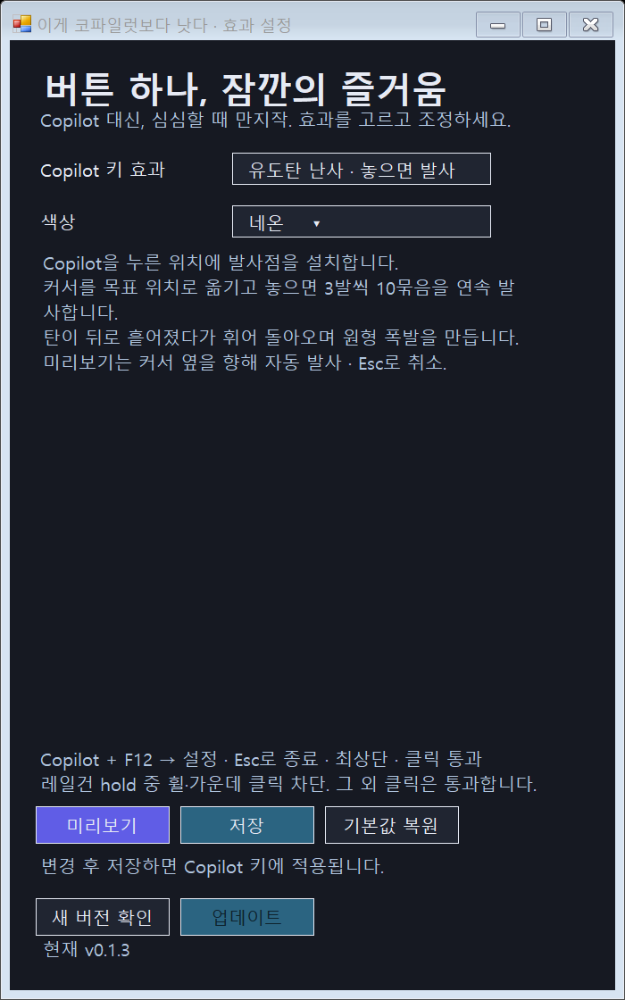

# 이게 코파일럿보다 낫다

**Copilot 키보다 재밌는 걸 만들자.** 심심할 때 만지작거리는 Windows 데스크톱 장난감.

투명한 최상단 창 하나에 효과를 그립니다. 일반 클릭은 아래 앱으로 통과하고, 효과가 끝나면 프로세스도 종료됩니다. 상주 서비스와 시작 프로그램 등록은 없습니다.

## 사용하기

1. [Releases](https://github.com/lemoncube7/better-than-copilot-key/releases)에서 Windows ZIP을 받아 압축을 풉니다.
2. `이게 코파일럿보다 낫다.exe`를 열어 효과를 고르고 **저장**합니다. **미리보기**는 저장 전 값도 시험할 수 있습니다.
3. PowerToys → Keyboard Manager에서 Copilot 키 신호를 **앱 열기**로 연결합니다.
4. 프로그램 경로에 같은 폴더의 `copilot_key.exe`를 선택합니다. 인수·시작 디렉터리는 비워둡니다.
5. **이미 실행 중인 경우 → 아무것도 하지 않기**, 실행 계정·창 표시는 **보통**으로 둡니다.

이 프로젝트를 만든 노트북의 Copilot 신호는 `왼쪽 Win + 왼쪽 Shift + F23`입니다. 실제 키를 입력해서 매핑하세요. 처음 실행 뒤의 hold down/up은 효과 엔진이 F23 키보드 훅으로 직접 받고 소비하여 반복 실행을 막습니다. **Copilot을 누른 채 F12를 누르고 놓으면 설정 창이 열립니다.** 기존 설정 창이 있으면 재사용합니다. 일반 F12 입력은 그대로 전달됩니다. 다른 장치의 Copilot 키 신호는 아직 검증하지 않았습니다.

## 효과

| 효과 | 조작 |
| --- | --- |
| 색종이 폭죽 | 키를 누르면 양쪽에서 색종이 발사 |
| 커서 중력장 | 별가루가 커서에 끌려오고 가까워지면 폭발 |
| 별가루 클러스터 | 마우스 위치·속도로 발사, 시간 또는 화면 경계에서 폭발. 클릭·Space·새총 모드 지원 |
| 블랙홀 | hold로 별을 모으고 release로 모은 수만큼 방출. 뉴턴 중력장에 중심부 완화 적용, 공전·성장·생성량 조정 |
| 진자 | 커서에 매달린 진자를 흔들어 가속하고 release로 발사. 탄성 줄 선택 가능 |
| 십자가 섬광 | hold로 십자 광선 충전, release로 폭발 |
| 레일건 | hold 시작 위치에 설치, 휠 클릭으로 추가 설치(최대 16개), 휠 또는 터치패드 두 손가락 이동으로 함께 충전, 커서 조준, release로 동시 발사. 충전량에 따라 폭발 입자의 모양·속도·수명이 변화 |
| 유도탄 난사 | hold 시작 위치에 발사점 설치, 커서를 목표로 옮겨 release. 3발씩 10묶음이 뒤로 발사된 후 휘어 돌아오며 원형 폭발 |
| 주사위 | hold 중 마우스를 흔들면 회전, 멈추면 한 면으로 정렬. release 뒤 1.5초 결과 표시 |

레일건을 hold하는 동안에는 휠과 가운데 클릭을 소비해서 뒤쪽 앱의 스크롤·자동 스크롤을 막습니다. 그 외 클릭은 통과합니다. 클릭/Space 클러스터 모드는 해당 입력이 뒤쪽 앱에도 전달됩니다.

**Esc**로 전체 효과를 취소합니다. 키를 누른 채 취소했다면 키를 놓을 때 프로세스가 완전히 종료됩니다. Esc 자체는 뒤쪽 앱에도 전달됩니다. 주사위는 시각적 장난감이며 공정한 무작위 추첨 도구가 아닙니다.

## 렌더링과 입력

픽셀별 알파 투명도로 빛과 잔상을 뒤 화면에 합성합니다. 레일건·주사위·색종이는 불투명하게 유지합니다. 변경된 영역만 다시 계산하고 첫 프레임을 즉시 표시합니다. 유휴 상태 뒤의 최초 실행에는 Windows 로딩 상태 등에 따른 추가 지연이 생길 수 있으며, 원인은 아직 확정되지 않았습니다.

두 손가락 충전은 패드 폭 약 3.5% 이동을 휠 한 칸으로 환산하며, `휠·두 손가락 충전량` 설정을 함께 사용합니다. 손가락이 닿거나 멈춰 있을 때는 충전하지 않습니다. 터치패드 HID는 아래의 기기 제한이 적용됩니다.

## 설정

설정 앱을 열면 최신 정식 버전을 비동기로 확인합니다. **새 버전 확인**으로 다시 조회하고, 새 버전이 있으면 **업데이트** 버튼으로 다운로드·검증·교체합니다. 설정 앱은 자동으로 다시 열리며 `settings.json`은 보존됩니다. Copilot 효과 실행에서는 네트워크를 사용하지 않습니다.

업데이트는 이 저장소의 GitHub Release ZIP만 받으며 SHA-256과 실행 파일 버전을 확인합니다. 다운로드나 교체가 실패하면 기존 버전을 유지합니다. 최초 v0.1.0에는 업데이트 기능이 없으므로 v0.1.1을 한 번 받아야 합니다.

`settings.json`은 실행 파일 옆에 생성됩니다. 미리보기와 저장은 분리되어 있습니다. 파일이 없다면 기본값을 사용합니다. `settings.example.json`에는 기본 설정만 담았습니다.



## 빌드

Windows x64, .NET Framework 4.x, Visual Studio 또는 Build Tools의 **C++ 데스크톱 개발** 도구가 필요합니다.

```powershell
.\build.ps1
```

현재 폴더에 `이게 코파일럿보다 낫다.exe`와 `copilot_key.exe`가 생성됩니다. C# WinForms는 설정 UI, C++ Win32/GDI는 효과와 입력을 담당합니다. 설치 과정이나 외부 패키지 다운로드는 없습니다.

## 개발 검증

태그 `v0.1.3`처럼 `v숫자.숫자.숫자`를 push하면 GitHub Actions가 Windows에서 빌드·네이티브 자체 검사·업데이트 복구 검사를 수행하고 ZIP과 SHA256.txt를 Releases에 올립니다. GitHub의 Release 화면에서 태그를 생성해 게시하는 경우에도 작동합니다. Actions의 **Windows build and release → Run workflow**에서 버전 번호를 입력해 배포할 수도 있습니다.

소스 커밋과 push는 개발자가 직접 합니다. 로컬 파일을 감시하거나 자동으로 소스를 올리지는 않습니다.

```powershell
.\copilot_key.exe --selftest --verify selftest.log
.\"이게 코파일럿보다 낫다.exe" --ui-test ui-check
```

UI 테스트는 실행 폴더의 설정을 변경하므로 개인 설정이 없는 별도 테스트 폴더에서 실행하세요. 물리 계산·경계 충돌·입력 상태·주사위 정렬·설정 UI 검사를 포함합니다. 실제 Copilot 키 hold 동작은 장치별로 직접 확인해야 합니다.

## 파일

- `NativeEffects.cpp`: 효과 엔진, 입력 훅, 단일 투명 창
- `App.cs`: 효과 선택 및 설정 UI
- `Settings.cs`: 설정 스키마, 기본값, 저장
- `build.ps1`: Windows 빌드
- `Update.cs`: 버전 확인, 다운로드 검증, 설정을 보존하는 실행 파일 교체
- `VERSION`: 로컬 빌드 기본 버전. 배포 빌드는 태그 버전을 사용
- `package.ps1`: 빌드·검사·배포 ZIP 생성
- `.github/workflows/release.yml`: 자동 빌드·배포
- `settings.example.json`: 공개 기본 설정

라이선스는 아직 지정하지 않았습니다.

## 터치패드 별가루
효과 목록에서 터치패드 · 별가루를 선택합니다. 터치패드의 최대 5개 접촉 위치를 실행 당시 커서가 있는 모니터로 대응시켜 빛과 궤적을 그립니다. 시작 후 입력 대기 12초, 마지막 접촉 후 8초 동안 입력이 없으면 종료합니다. Esc로 취소할 수 있으며 커서 이동과 클릭은 그대로 전달됩니다. 제공된 LG/04CA00A0 계열 30바이트 HID 형식을 사용하므로 다른 터치패드에서는 동작하지 않을 수 있습니다. Touchpad.h는 패킷 검사, TouchpadEngine.inl은 Raw Input과 별가루 생성을 담당합니다.

## 터치패드 그림판

효과 목록에서 **터치패드 · 그림판**을 선택합니다. **그리는 곳**에서 **화면 위에 그리기** 또는 **흰 그림판**을 고르고 저장합니다. Copilot 키로 열고 다시 눌러 닫습니다. 최대 5개 손가락의 획을 독립적으로 그리며 손가락을 떼면 해당 획이 끊깁니다. 자동 종료 없이 유지되며 Esc로 취소할 수 있습니다. 닫으면 그림은 사라집니다.

기본값은 화면 위에 그리기입니다. 터치패드 전체를 실행 당시 커서가 있는 모니터에 대응시킵니다. 커서 이동과 클릭은 뒤쪽 앱에도 전달됩니다. 터치패드 입력은 제공된 LG/04CA00A0 계열의 30바이트 HID 형식을 사용하므로 친구의 다른 노트북에서는 동작하지 않을 수 있습니다. 마우스로 조작하는 다른 효과는 터치패드 HID에 의존하지 않습니다.

`이게 코파일럿보다 낫다.exe`를 실행하세요. `차라리 이거.exe`는 v0.1.1 사용자의 업데이트 호환용으로 함께 제공합니다.
